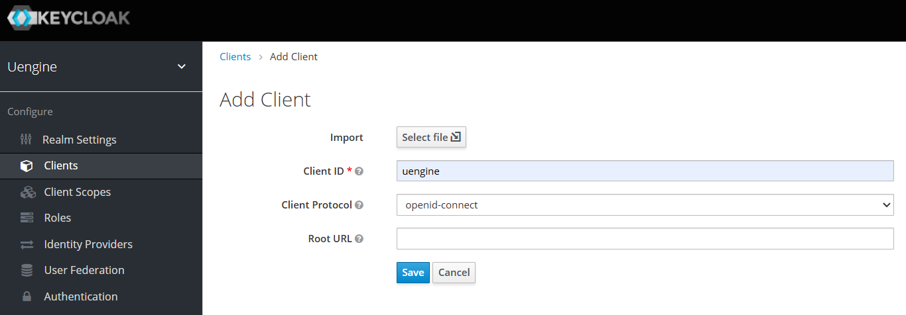
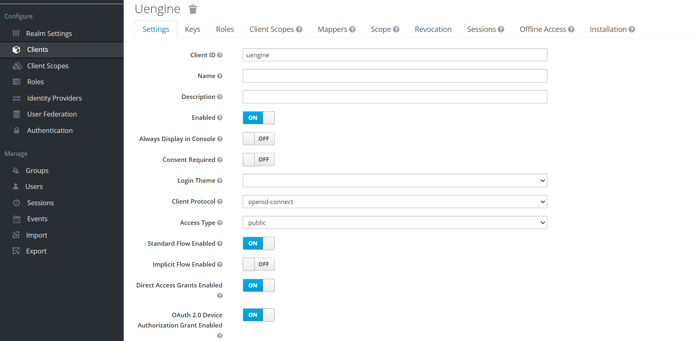
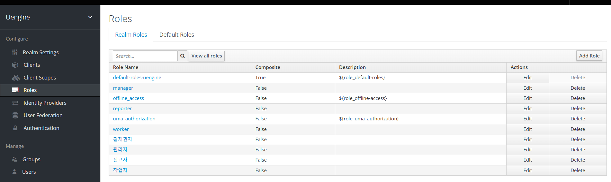
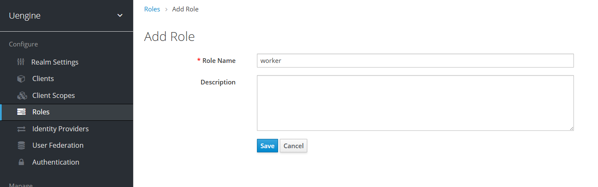
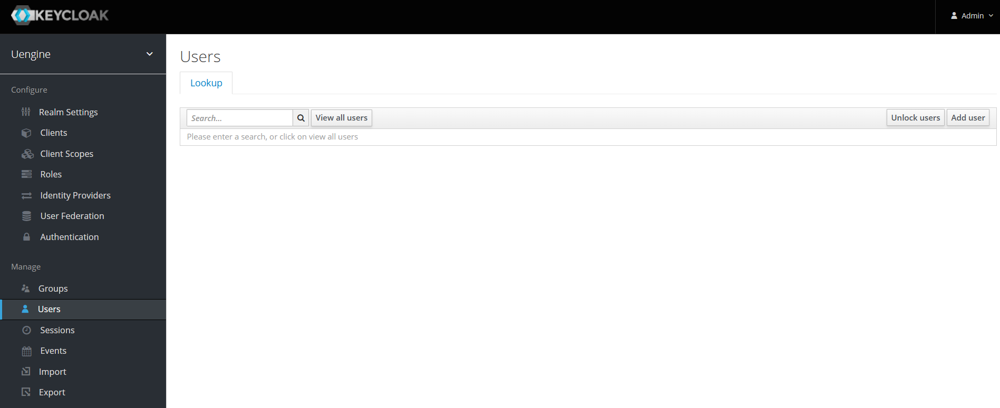
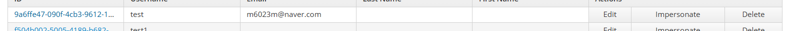
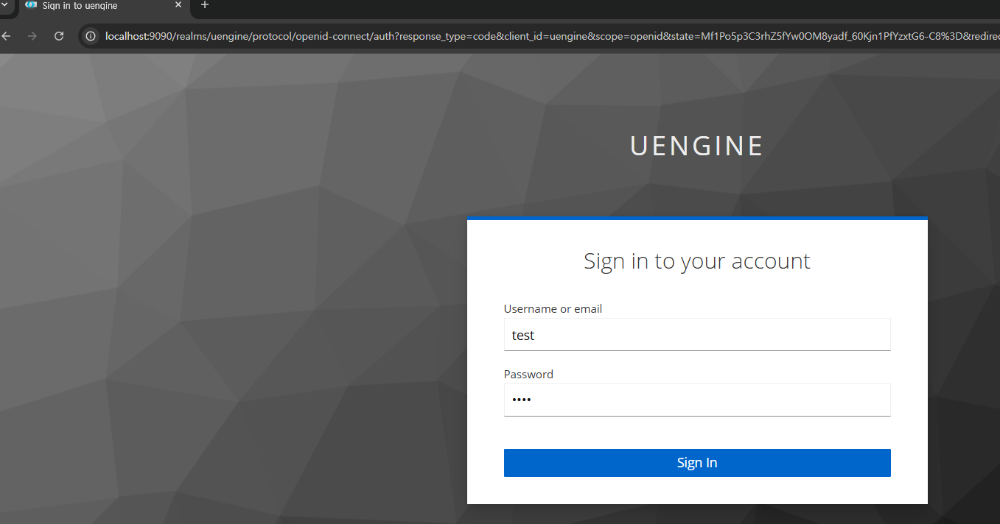
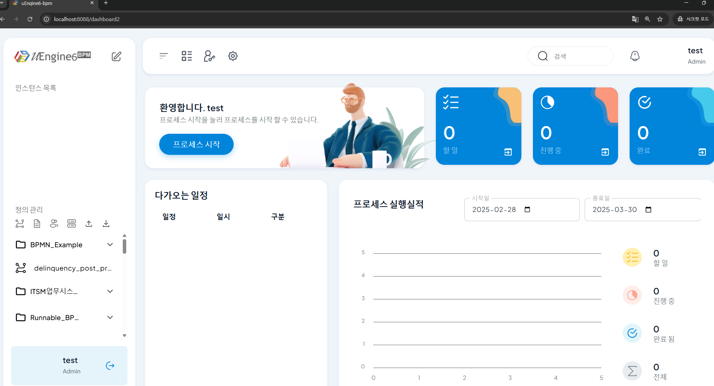

# Account Management and Access Methods

## Keycloak Configuration

Keycloak is an open-source solution for authentication and authorization management in uEngine6. You can set up Keycloak to perform user authentication and permission management.

### Accessing the Keycloak Administrator Page

To access the Keycloak administrator page, use the following URL:

```
http://localhost:9090
```


### Default Administrator Account

The default administrator account for Keycloak is as follows:

- **Username**: `admin`
- **Password**: `admin`

You can use this account to log in to the Keycloak administrator page. After logging in, it is recommended to change the administrator account password as needed.


### Adding uEngine Client

You can add an uEngine client to set up integration with uEngine6. Follow these steps to add a client

Log in and click on clients from the screen


Click the Create button to open the settings screen



Set the name to uengine and click the Save button

When successfully created, the client will be added as shown below


Click the Edit button here to open the settings screen

Configure the settings to match the screen below and click the Save button



### Role Configuration

To configure roles, click on Roles to check the role list.



If you want to add a role, click the Add Role button in the upper right corner to add a role.



Enter the role name on this screen and click the save button to add the role.

When the role is added, you can confirm that the role has been added as shown below.


### Adding Users

To add users, click on Users to check the user list.



If you want to add a user, click the Add User button in the upper right corner to add a user.


Enter the username on this screen and click the save button to add the user.

When the user is added, you can confirm that the user has been added as shown below.



Click the Edit button here to open the user settings screen to assign roles to the user and set a password


In the Credentials tab, set the password and click the reset password button to specify the password.


Assign roles to the user in the Role Mappings tab.
Select the roles to assign to the user from Available Roles and click the Add Selected button to assign roles to the user.

### Verifying User Access

To verify user access, log in using the username and password.



After logging in, press the start button to enter the dashboard, and you can see the user access verification screen as shown below.




