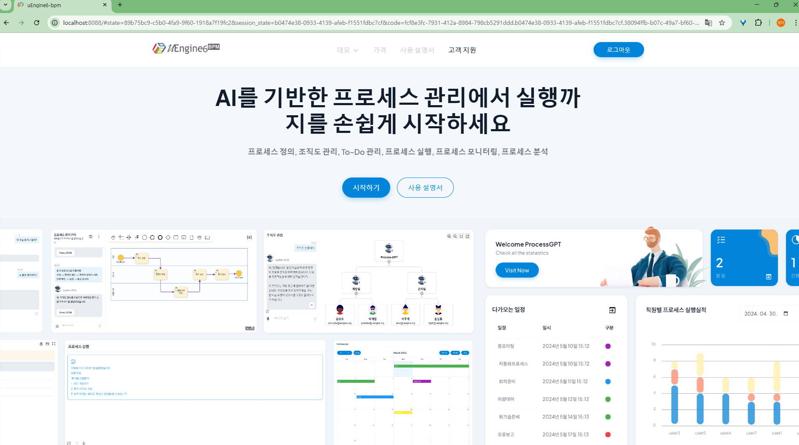

# Running

## Project Preparation
- **Clone Project**:Clone the uEngine project from GitHub.
```sh
git clone https://github.com/uengine-oss/uEngine6.git
```

## Local Execution
To run uEngine locally, a Kafka server is required for asynchronous communication. Therefore, you must first run the Kafka server.
- Kafka server installation and execution
  - Visit https://kafka.apache.org/ to install and run.

- uEngine execution
```sh
# Process Service execution(port 9094)-process execution service
cd /process-service
mvn spring-boot:run

# Definition Service execution(port 9093)-process definition service
cd /definition-service
mvn spring-boot:run

# Gateway Service execution(port 8088)-API gateway
cd /gateway
mvn spring-boot:run
```


## Docker Execution

To run uEngine using Docker, follow these steps:

1. **Directory Navigation**: Navigate to the root directory of the cloned project.
```sh
cd uengine
```
2. **Run Docker Compose**: Use Docker Compose to run uEngine. Use the Docker Compose file located in the `infra` folder.
```sh
# Docker Compose
cd infra
docker compose up
```
    This command starts all services defined in the `infra` folder.

3. **Execution Confirmation**:
When execution is complete, the uEngine-related docker images will be running as shown in the following image.


4. **Terminate uEngine**: To terminate uEngine, use the following command.
```sh
docker compose down
```

## Check Execution Screen

When uEngine is running properly, open a web browser and access the following URL to check the execution screen.


- You can check at : 
http://localhost:8088/


